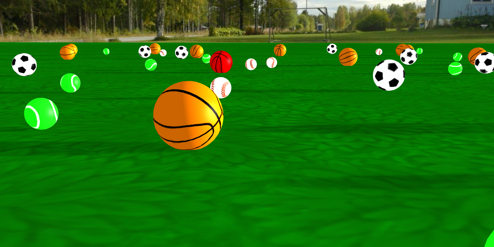

### Three-js - Football Field Scene

**Installtation**  
Open up a server  
`
python server.py
`  
Enter `localhost:8000` on your local browser  

**Features:**  
Natural light and shadows  
&nbsp;&nbsp;&nbsp;&nbsp;combination of ambient, directional, and hemisphere light  
Camera movement  
&nbsp;&nbsp;&nbsp;&nbsp;rotation - left mouse dragging    
&nbsp;&nbsp;&nbsp;&nbsp;transition - right mouse dragging    
&nbsp;&nbsp;&nbsp;&nbsp;zoom-in/zoom-out - mouse scrolling    
Skybox and models  
Highlighting objects on mouse hover using raycaster  
Texture mapping  
&nbsp;&nbsp;&nbsp;&nbsp;bump mapping, normal mapping  

**Assets:**  
OpenGameArt.org (Skybox and floor textures)  
https://opengameart.org/content/handpainted-grass-texture-pack    
jeromeetienne (Sports ball textures)  
https://github.com/jeromeetienne/threex.sportballs   
Threejs examples (Raytracing)   
https://threejs.org/examples/#webgl_camera_cinematic
